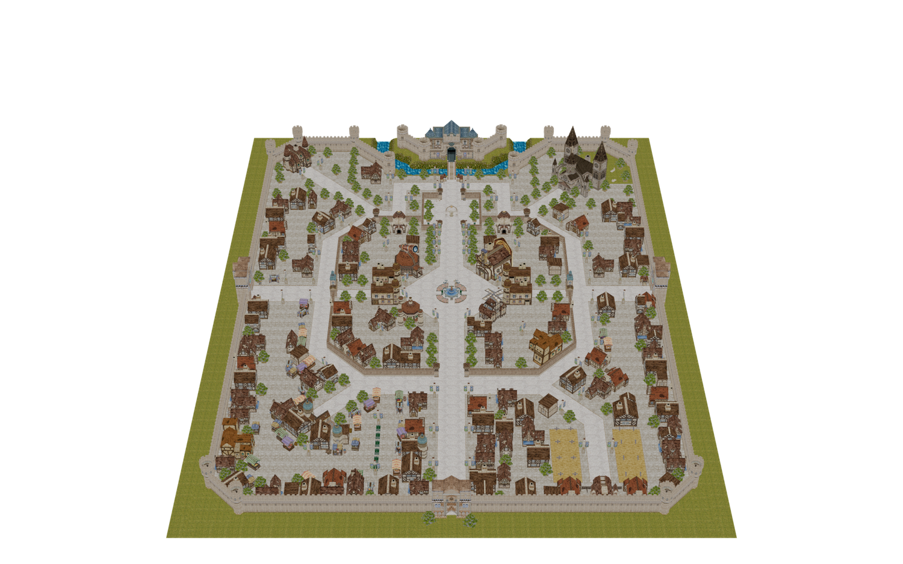
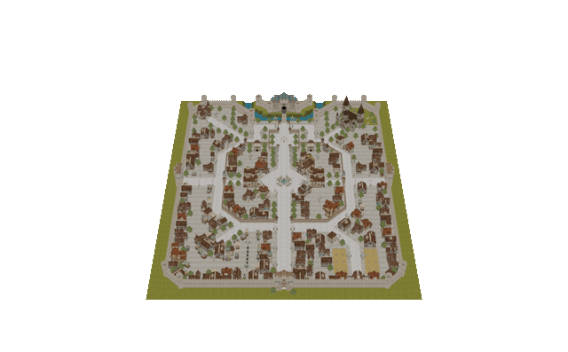
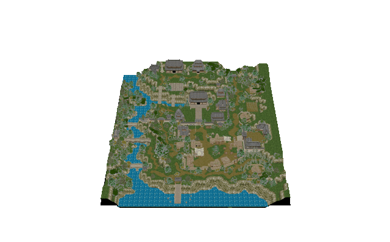
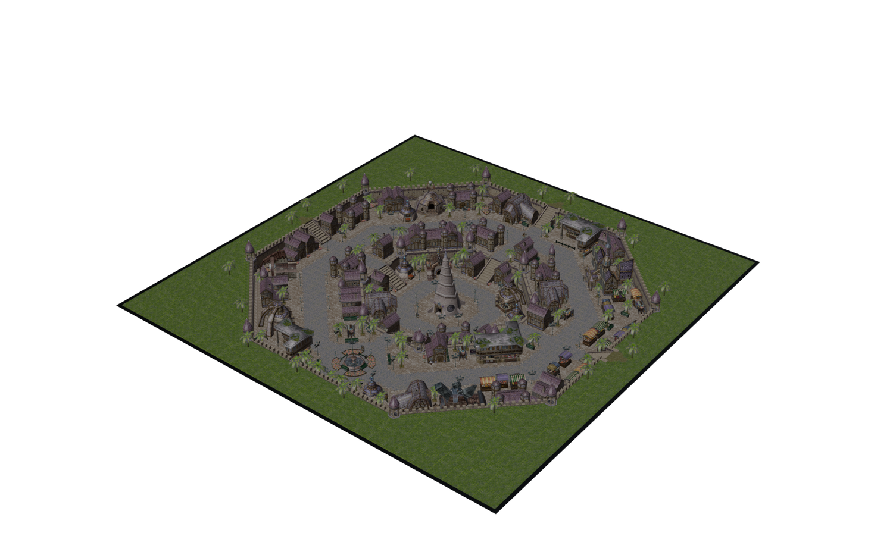
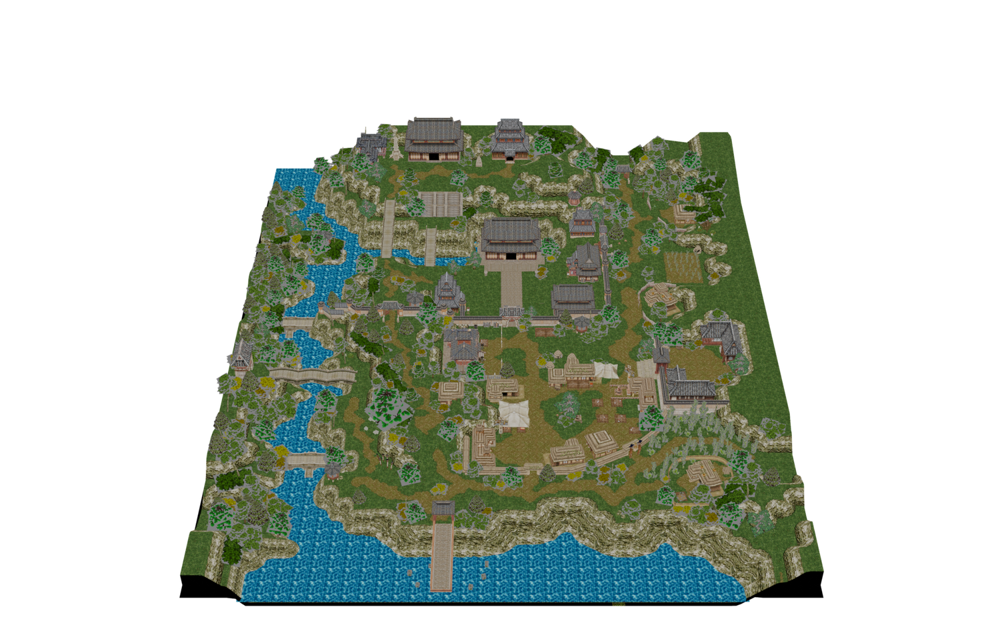

# ragx

**ragx** exports the assets of a **Ragnarok Online** client to open,
engine-neutral formats. It reads the client's GRF archives directly — there is
no separate "extract" step — and gives you:

| Command | What it does | Output |
|---|---|---|
| `ragx maps` | maps & models → **glTF 2.0** | `.gltf` + `.bin` (+ shared `textures/`), or `.glb` |
| `ragx sprites` | SPR/ACT sprites → **spritesheet + animation** | packed `.png` + `.json` |
| `ragx effects` | STR skill / visual effects ("spells") → **atlas + keyframes** | packed `.png` + `.json` |
| `ragx ui` | interface bitmaps → **transparent PNG** | magenta-keyed `.png` + theme textures |

Built for and tested against the **LATAM client** (`C:\Gravity\Ragnarok`), but
the parsers cover every GRF/format version found in modern and classic clients.

<p align="center">
  
</p>

> **Learning project.** ragx ships **no game data** and is for studying the
> Ragnarok Online file formats with a client you legally own. Ragnarok Online
> and all of its assets are © **Gravity Co., Ltd.** — see
> [Disclaimer & Legal](#disclaimer--legal).

---

## Showcase

Maps converted straight from the client `data.grf` and rendered in Blender
(Workbench) — geometry, textures, placement, normals and looping animations,
with no manual cleanup:

<p align="center">
  
  
</p>

<p align="center">
  
  
</p>

<sub>Prontera &amp; Payon turntables; Geffen studio-lit (exercising the model
normals) and Payon textured. Regenerate with
<a href="tools/render_showcase.py"><code>tools/render_showcase.py</code></a>.
All assets © Gravity Co., Ltd.</sub>

---

## Contents

- [Showcase](#showcase)
- [Requirements](#requirements)
- [Install](#install)
- [Quick start](#quick-start)
- [Command reference](#command-reference) — every option of every command
  - [Common options](#common-options)
  - [`ragx maps`](#ragx-maps)
  - [`ragx sprites`](#ragx-sprites)
  - [`ragx effects`](#ragx-effects)
  - [`ragx ui`](#ragx-ui)
- [Output layout](#output-layout)
- [What it handles](#what-it-handles)
- [Output JSON formats](#output-json-formats)
- [How it works](#how-it-works)
- [Disclaimer & Legal](#disclaimer--legal)
- [Acknowledgements](#acknowledgements)
- [License](#license)

---

## Requirements

- **Python 3.10+**
- `numpy` and `Pillow` (installed automatically by `pip`)
- A **Ragnarok Online client install** you own, containing `data.grf`
  (default location `C:\Gravity\Ragnarok`)
- *Optional:* [Blender](https://www.blender.org/) 4.x or any glTF viewer to open
  the converted maps

## Install

From this folder:

```sh
pip install -e .          # installs the `ragx` command + numpy/Pillow
```

or run it without installing:

```sh
python -m ragx --help
```

## Quick start

```sh
# Maps → glTF
ragx maps prontera                       # one map  → ragx_out/maps/prontera.gltf
ragx maps prontera izlude geffen -j 8     # several maps, 8 worker processes
ragx maps --all -j 8                      # every map in the client
ragx maps prontera --format glb           # single self-contained .glb
ragx maps --list                          # just print every available map name

# Sprites → spritesheet + animation JSON
ragx sprites 몬스터/poring                 # one sprite (path under data/sprite/)
ragx sprites --all -j 8                   # every SPR/ACT pair in the client

# Effects ("spells") → atlas + keyframe JSON
ragx effects lord stormgust               # named effects (full path or basename)
ragx effects --all                        # every STR effect in the client

# UI → transparent PNG
ragx ui                                   # base interface
ragx ui --skin "America Latina"           # overlay a named client skin

# Point at a client installed somewhere else
ragx maps prontera --client "D:/Games/RO" -o D:/ro_export
```

---

## Command reference

```
ragx [-h] [--version] <command> [options]
```

| Top-level option | Description |
|---|---|
| `-h`, `--help` | show help and exit (works on every command, e.g. `ragx maps --help`) |
| `--version` | print the ragx version and exit |

### Common options

Every command accepts these:

| Option | Default | Description |
|---|---|---|
| `--client DIR` | `C:\Gravity\Ragnarok` | Ragnarok Online install folder containing `data.grf` (and optionally `event.grf`, layered on top like the client does) |
| `-o`, `--out DIR` | `./ragx_out` | output root; each command writes its own sub-folder (`maps/`, `sprites/`, `effects/`, `ui/`) under it |
| `-h`, `--help` | — | show this command's help and exit |

### `ragx maps`

Convert maps and their models to glTF 2.0.

```
ragx maps [MAP ...] [--all] [-f {gltf,glb}] [-j N] [--world-scale FACTOR] [--list] [common options]
```

| Argument / option | Default | Description |
|---|---|---|
| `MAP ...` | — | one or more map names, without extension (e.g. `prontera`, `prt_in`) |
| `--all` | off | convert **every** map in the client (hundreds; slow to convert) |
| `-f`, `--format {gltf,glb}` | `gltf` | `gltf` = `.gltf` + `.bin` with a shared `textures/` folder (smallest across many maps); `glb` = one self-contained binary file per map |
| `-j`, `--processes N` | `1` | number of parallel worker processes |
| `--world-scale FACTOR` | `1.0` | bake every exported position, translation, and world-space length by this positive factor; normals and rotations stay unchanged |
| `--list` | off | print every available map name and exit (no conversion) |

**Examples**

```sh
ragx maps prontera                        # → ragx_out/maps/prontera.gltf (+ .bin, textures/)
ragx maps prontera izlude payon -j 4      # convert three maps in parallel
ragx maps --all -j 8                      # whole world
ragx maps geffen --format glb             # → ragx_out/maps/geffen.glb (single file)
ragx maps prontera --world-scale 0.2       # bake a 1 m GAT-cell convention
ragx maps --list | findstr prt            # find every "prt*" map (Windows)
```

### `ragx sprites`

Export SPR/ACT sprite pairs (characters, monsters, NPCs, equipment) to a
shelf-packed spritesheet PNG plus an animation JSON.

```
ragx sprites [PATH ...] [--all] [-j N] [common options]
```

| Argument / option | Default | Description |
|---|---|---|
| `PATH ...` | — | sprite paths **relative to `data/sprite/`**, without extension (e.g. `몬스터/poring`) |
| `--all` | off | export every SPR/ACT pair in the client (~80k pairs, several GB) |
| `-j`, `--processes N` | `1` | number of parallel worker processes |

**Examples**

```sh
ragx sprites 몬스터/poring                  # one monster → ragx_out/sprites/몬스터/poring.{png,json}
ragx sprites 몬스터/poring 몬스터/poporing     # several at once
ragx sprites --all -j 8                    # everything
```

### `ragx effects`

Export STR effects (skills, spells, visual effects) to a packed texture atlas
PNG plus a keyframe JSON.

```
ragx effects [NAME ...] [--all] [common options]
```

| Argument / option | Default | Description |
|---|---|---|
| `NAME ...` | — | effect names **relative to `texture/effect/`**, without extension; matched by full path **or** by basename |
| `--all` | off | export every STR effect in the client |

**Examples**

```sh
ragx effects lord                          # match by basename
ragx effects lord stormgust sanctuary      # several
ragx effects --all                         # every effect
```

### `ragx ui`

Export interface bitmaps (window chrome, buttons, gauges) to magenta-keyed
transparent PNGs, plus composited 9-slice theme textures (window frame, button
states, title bar). The base interface is read straight from the GRF; a named
skin folder, if given, is layered on top of it.

```
ragx ui [--skin NAME] [--groups GROUP ...] [common options]
```

| Option | Default | Description |
|---|---|---|
| `--skin NAME` | none | overlay a named skin from `<client>/skin/<NAME>/` on top of the base interface |
| `--groups GROUP ...` | all | limit export to specific interface groups (currently: `basic_interface`) |

**Examples**

```sh
ragx ui                                    # base interface → ragx_out/ui/skin/...
ragx ui --skin "America Latina"            # overlay a client skin
ragx ui --groups basic_interface           # only this group
```

---

## Output layout

Everything lands under `--out` (default `./ragx_out`):

```
ragx_out/
  maps/
    prontera.gltf          scene JSON (nodes, meshes, materials, animations)
    prontera.bin           geometry + animation buffers
    textures/              PNGs shared by every map (each unique texture once)
      프론테라/pron-ju-wall-7.png
  sprites/
    몬스터/poring.png         shelf-packed spritesheet
    몬스터/poring.json        frame rects + ACT animation
  effects/
    lord.png               packed texture atlas
    lord.json              fps + per-layer keyframe tracks
  ui/
    skin/basic_interface/  keyed window/button/gauge PNGs
    skin/theme/            composited window_frame / button_* / titlebar PNGs
```

In `gltf` mode the textures are de-duplicated in the shared `textures/` folder,
so converting the whole world is several times smaller than embedding textures
in every `.glb`. Use `--format glb` when you want one portable file per map.

## What it handles

### GRF archives

| Version | Notes |
|---|---|
| 0x102 / 0x103 | legacy; DES-obfuscated names, per-extension encryption |
| 0x200 | classic "Master of Magic" format |
| 0x300 | **"Event Horizon"** (late-2024+): 64-bit offsets for >4 GB archives — what the LATAM `data.grf` uses |

File names are CP949 (Korean), decoded and indexed lowercase. Encrypted entries
are decrypted with Gravity's broken single-round DES.

### Map / model / sprite / effect formats

| Format | Versions | Notes |
|---|---|---|
| RSW | 1.9 – 2.7 | scene: model placements, lights, water |
| GND | 1.7 – 1.9 | terrain cubes + water plane grids |
| GAT | 1.2, 1.3 | tile heights / walkability |
| RSM | 1.4 – 2.3 | models (`.rsm` and `.rsm2`) |
| SPR | 1.x – 2.1 | indexed + RGBA frames, RLE; palette index 0 = transparent |
| ACT | — | animation: actions, frames, layers, anchors, sound events |
| STR | 148 ("STRM") | layered billboard effects |

### glTF conversion semantics

- **Coordinates**: standard glTF (right-handed, +Y up), **-Z = map north**,
  terrain centred at the origin; one unit = one client world unit.
- **Terrain**: GND cubes → one mesh with a primitive per texture, vertex
  colours, the half-pixel UV inset that prevents bleeding, and Korangar-style
  normals smoothed globally by transformed position *before* material splitting.
  Vertical wall edges do not contribute to the smooth sum, so changing terrain
  texture cannot create a lighting seam.
- **Models**: each unique RSM is converted once and instanced per placement.
  The RSM1 Y-down convention is baked into the geometry so standalone models
  stand upright; genuinely mirrored placements use a pre-reversed-winding
  `@mirror` variant. Smooth-shaded RSMs combine every declared smoothing group
  by transformed position, including duplicated source vertices and RSM 2.2
  extra groups.
- **Animations**: rotation/translation/scale keyframes → glTF animation channels,
  **one animation per animated object** so each loops over its own duration.
  Timing follows the client (RSM1 frames = ms, RSM2 frames / fps, per-instance
  `animation_speed` with the `max(speed, 0.03)` rule).
- **Textures**: everything → PNG. (Near-)magenta key pixels become true
  transparent pixels (alphaMode MASK) with the RGB in-painted from neighbours so
  filtering leaves no fringe. TGA alpha is preserved; URIs are percent-encoded.
- **Water**: a semi-transparent plane over submerged tiles. **Light**: the RSW
  sun is exported via `KHR_lights_punctual`.

**Known limitations**: GND lightmaps are not baked in (vertex colours + the sun
are); RSM 2.3 UV-scroll/rotate and water cycling have no core-glTF equivalent
and are skipped; a few maps ship without terrain data and are skipped.

## Output JSON formats

**Sprites** (`sprites/<name>.json`):

```jsonc
{
  "w": 512, "h": 384,            // sheet size
  "frames": [[x, y, w, h], ...], // sheet rect per SPR frame (palette pool, then RGBA pool)
  "indexed_count": 40,           // size of the palette pool
  "sheet": "몬스터/poring.png",     // the PNG this json points at (sprites may share a sheet)
  "actions": [                   // action = base*8 + direction
    { "delay": 4.0, "frames": [
        { "layers": [[x, y, frame, mirror], ...],  // short form, or 11-field full form
          "anchor": [x, y], "event": 0 } ] } ],
  "events": ["atk", "sound/_novice_attack.wav"]
}
```

**Effects** (`effects/<name>.json`):

```jsonc
{
  "fps": 60, "max_key": 120,
  "w": 1024, "h": 512,
  "textures": [[x, y, w, h], ...],     // atlas rect per global texture
  "layers": [
    { "tex": [0, 1],                   // this layer's texture pool (global indices)
      "keys": [[frame, type, px, py, x0,x1,x2,x3, y0,y1,y2,y3,
                aniframe, anitype, delay, angle, r, g, b, a, blend], ...] } ]
}
```

`blend` is a resolved family (`0` mix, `1` add, `2` premul); `type` is `0`
absolute / `1` per-frame increments. The keyframes — not baked frames — are
exported, so playback is tiny and frame-rate independent.

## How it works

```
ragx/
  cli.py            unified argument parser + dispatch
  client.py         locating/opening the client's GRF archives
  grf.py            GRF reader (all versions + DES decryption)
  formats/          binary parsers: gnd gat rsw rsm spr act imf str
  model_builder.py  RSM → shareable glTF template
  map_builder.py    terrain + water + instances + lights → glTF/GLB
  gltf.py           minimal glTF/GLB writer
  textures.py       BMP/TGA/JPG → PNG, magenta keying
  mathutil.py       matrices/quaternions + RO→glTF mirroring
  commands/         one module per command: gltf sprites effects ui
```

The argument parser lives in `cli.py` so `--help` stays instant; the heavy work
(numpy/Pillow, the builders) is imported lazily once a command is chosen.

## Disclaimer & Legal

**This project is for educational purposes only.**

ragx is a learning exercise in reverse-engineering and understanding the
Ragnarok Online file formats. It is **not** affiliated with, endorsed by, or
sponsored by Gravity Co., Ltd. or any of its partners or publishers.

- **Ragnarok Online**, and all of its assets — including but not limited to
  graphics, models, sprites, sounds, maps and game data — are the property of
  and **© Gravity Co., Ltd.** All rights reserved by their respective owners.
- ragx **contains and distributes no game data whatsoever.** It only reads files
  from a Ragnarok Online client that **you have legally installed and own**.
- The converted output is derived from copyrighted assets and must **not** be
  redistributed. Use it only for personal, educational, and research purposes,
  in accordance with Gravity's terms of service and applicable law.

If you are a rights holder and have any concern about this repository, please
open an issue.

## Acknowledgements

Format knowledge comes from studying these projects:

- [korangar](https://github.com/vE5li/korangar) — Rust RO client; the
  transform/animation math and the DES port follow it closely
- [GRF Editor](https://github.com/Tokeiburu/GRFEditor) — GRF 0x300 layout and
  legacy filename decryption
- [RagnarokFileFormats](https://github.com/rdw-archive/RagnarokFileFormats) —
  prose specs for GND/RSW/RSM
- [RagLite](https://github.com/RagnarokResearchLab/RagLite) — RSW header details

## License

ragx's **source code** is released under the [MIT License](LICENSE). This license
applies only to the code in this repository — **not** to any Ragnarok Online
asset or to output produced from one (see [Disclaimer & Legal](#disclaimer--legal)).
